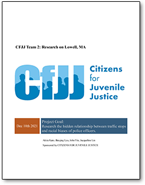
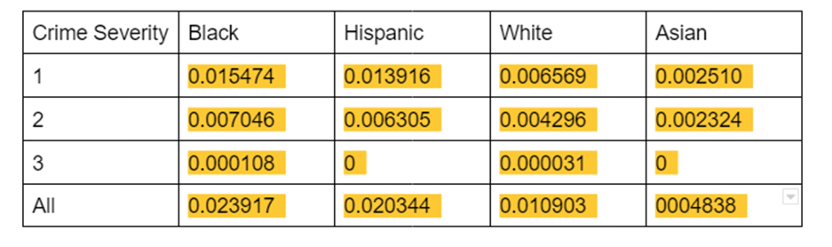
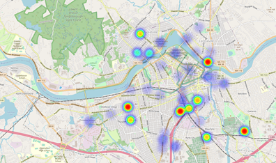
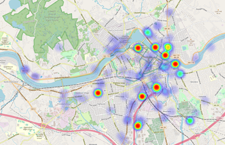
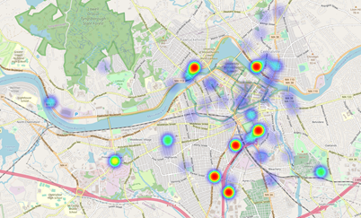
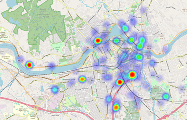

# CFJJ Team 2 Lowell: Hidden Relationship between traffic stops and Lowell PD's racial bias

**Akira Kato, Baiqing Lyu, Zhenghang Yin, Jacqueline Lin**

Sponsored by **Citizens for Juvenile Justice (CFJJ)**

---

For detailed explanation, please see the report: 

## **Project Motivation**

Advocating statewide systemic reform to achieve equitable youth justice.

**Project Goal**: 

Research the hidden relationship between traffic stops and racial biases of police officers.

## Dataset and its challenges

### **Data**

We receive several excel sheets on the traffic stops in Lowell area, Massachusetts, containing police ID, offense descriptions, citation number, occurrence time and address, offenders’ race, gender, and the year of birth. We attach the severity labels through offense descriptions and geographic coordinates with zip code through the address. 

### **Challenges**

We have 9.64% of unknown offenders’ races , which could be a potential bias to our research. Also, the race makeup ratio of smaller areas in Lowell are not available online, and, unfortunately, we did not receive the detailed race ratio in time from the professor we reached out towards. As a result, we don’t have further research on the race bias on traffic stops. Data cleaning was also difficult to automate due to random patterns of concatenated features.

## Analysis

### **Data visualization**

- **Plot map** group by zip code and severity label

- **Heatmap** of traffic stops group by race

### **Mathematical mode**

- Calculation on **skewnesses** for each race ratio grouped by severity label, to see the race bias on traffic stops

  Heatmap helps answer where enforcements are focusing their attention. 

## **Results**

### Streets with high police activity:

- [Auburn street](https://www.google.com/maps/place/Auburn+St,+Lowell,+MA+01852/@42.6367914,-71.3097802,17z)

- [England street](https://www.google.com/maps/place/England+St,+Lowell,+MA+01852/@42.6237931,-71.294673,17z)

- [Hale street](https://www.google.com/maps/place/Hale+St,+Lowell,+MA+01851/@42.6330948,-71.3190447,17z)

### Crime severity percentage (Massachusetts Master Crime List):

- 64.4% have the severity of 1 (light)

- 35.1% have the severity of 2 (moderate)

- 0.5% have severity 3 (severe)

### Crime Density ordering consistently

- Black → Hispanic → White → Asian

- Black and Hispanic disproportionately large

### Map View

| Area     | Map View                                      |
| -------- | --------------------------------------------- |
| Asian    |        |
| Hispanic |  |
| Black    |        |
| White    |        |

## Conclusions and next steps

- Black and Hispanic average crime severity given by police officers are typically twice as high as white individuals, and four times as high as Asian individuals.

- Ask for more clarification on excel sheet about officers’ information and connect the officers’ information with the current dataset we use. 