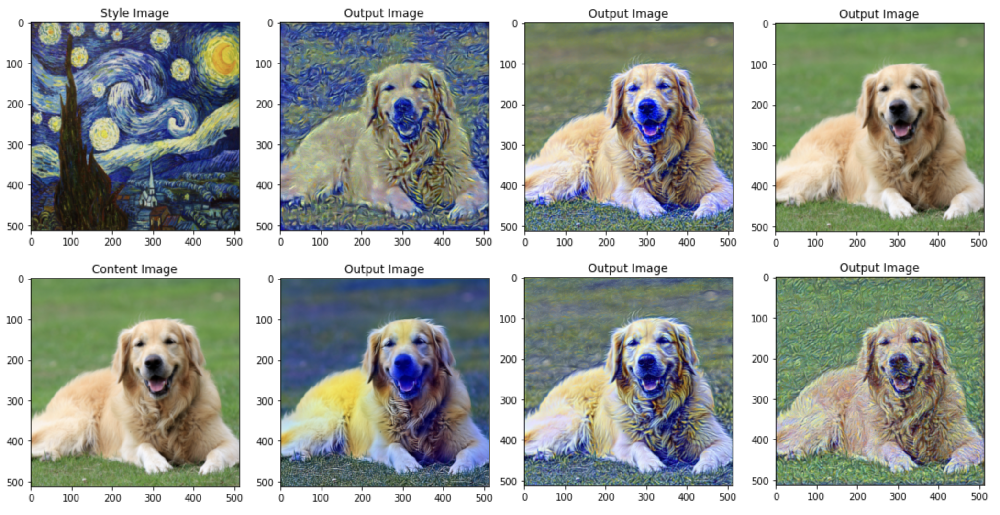

# Deep Learning Applications Exploration

This repository lists all the documentation of the algorithms and projects I worked on in the AI-related courses I took at **Boston University**.

* [**ConvNet and Style transfer**](./CS523_HW3_CNN_n_Style_Transfer.ipynb) 
  *   Implemented the Style transfer learning methods to produce excellent results on very small datasets with little computational time.
  
  * Imported the famous VGG19 model, and basing on specific input data, finetuneed the network structures and parameters for different style results.
  
    
  
* [**Bias and GANs**](./CS523_HW4_Bias_n_GANs.ipynb) 
  
  * Implemented the Generator to generate images looks real to fool the discriminator, and the Discriminator, to act as a fact checker to determine which image is fake or real.
  
  * Imported DCGAN model, produce a model to turn characters with any color hairs into realistic black, blonde, or brown hairs.
  
    
  
* [**Reinforcement Learning**](./CS523_HW5_RL_n_Transformers.ipynb) 

* - Cartpole games (Discrete action spaces) with the DQN algorithm

    

* - Pendulum games (Continuous action spaces) with DDPG algorithm.

    
